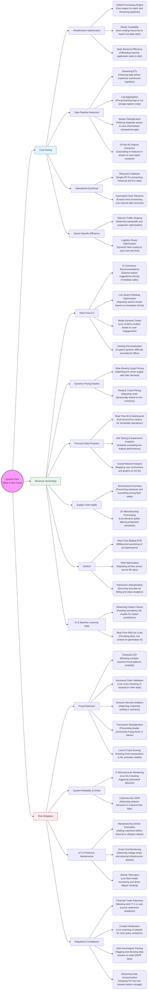

```mermaid
graph LR
    %% Main Title
    Root((Apache Flink<br/>Value & Use Cases))

    %% LEVEL 1: Main Branches
    Root --> CS[Cost Saving]
    Root --> RG[Revenue Generating]
    Root --> RM[Risk Mitigation]

    %% LEVEL 2 & 3: Cost Saving
    CS --> CS1[Infrastructure Optimization]
    CS1 --> CS1a("Unified Processing Engine<br/>(One engine for batch and streaming pipelines)")
    CS1 --> CS1b("Elastic Scalability<br/>(Auto-scaling resources to match live data rates)")
    CS1 --> CS1c("State Backend Efficiency<br/>(Offloading massive application state to disk)")

    CS --> CS2[Data Pipeline Reduction]
    CS2 --> CS2a("Streaming ETL<br/>(Cleaning data before expensive warehouse ingestion)")
    CS2 --> CS2b("Log Aggregation<br/>(Pre-processing logs to cut storage egress costs)")
    CS2 --> CS2c("Stream Deduplication<br/>(Filtering duplicate events to save downstream compute/storage)")
    CS2 --> CS2d("On-the-fly Feature Extraction<br/>(Calculating AI features in-stream to save batch compute)")

    CS --> CS3[Operational Overhead]
    CS3 --> CS3a("Reduced Codebase<br/>(Single API for processing historical and live data)")
    CS3 --> CS3b("Automated Fault Tolerance<br/>(Exactly-once processing cuts manual data recovery)")

    CS --> CS4[Sector-Specific Efficiency]
    CS4 --> CS4a("Telecom Traffic Shaping<br/>(Real-time bandwidth and congestion optimization)")
    CS4 --> CS4b("Logistics Route Optimization<br/>(Dynamic fleet routing to save fuel and time)")

    %% LEVEL 2 & 3: Revenue Generating
    RG --> RG1[Real-Time CX]
    RG1 --> RG1a("E-Commerce Recommendations<br/>(Session-based suggestions driving immediate sales)")
    RG1 --> RG1b("Live Search Ranking Optimization<br/>(Adjusting search results based on immediate trends)")
    RG1 --> RG1c("Media Dynamic Feeds<br/>(Live content curation based on user engagement)")
    RG1 --> RG1d("Gaming Personalization<br/>(In-game dynamic difficulty and tailored offers)")

    RG --> RG2[Dynamic Pricing Models]
    RG2 --> RG2a("Ride-Sharing Surge Pricing<br/>(Matching live driver supply with rider demand)")
    RG2 --> RG2b("Retail & Travel Pricing<br/>(Adjusting costs dynamically based on live inventory)")

    RG --> RG3[Premium Data Products]
    RG3 --> RG3a("Real-Time BI & Dashboards<br/>(Sub-second live metrics for immediate operations)")
    RG3 --> RG3b("A/B Testing & Experiment Analytics<br/>(Instantly evaluating live feature performance)")
    RG3 --> RG3c("Social Network Analysis<br/>(Mapping user connections and graphs on the fly)")

    RG --> RG4[Supply Chain Agility]
    RG4 --> RG4a("Omnichannel Inventory<br/>(Preventing stockouts and overselling during flash sales)")
    RG4 --> RG4b("JIT Manufacturing Forecasting<br/>(Live demand spikes altering production schedules)")

    RG --> RG5[AdTech]
    RG5 --> RG5a("Real-Time Bidding RTB<br/>(Millisecond auctioning of ad impressions)")
    RG5 --> RG5b("Yield Optimization<br/>(Adjusting ad floor prices via live fill rates)")
    RG5 --> RG5c("Impression Deduplication<br/>(Ensuring accurate ad billing and clean analytics)")

    RG --> RG6[AI & Machine Learning Data]
    RG6 --> RG6a("Streaming Feature Stores<br/>(Feeding low-latency ML models for instant predictions)")
    RG6 --> RG6b("Real-Time RAG for LLMs<br/>(Providing fresh, live context for generative AI)")

    %% LEVEL 2 & 3: Risk Mitigation
    RM --> RM1[Fraud Detection]
    RM1 --> RM1a("Financial CEP<br/>(Blocking complex payment fraud patterns instantly)")
    RM1 --> RM1b("Insurance Claim Validation<br/>(Live cross-checking of suspicious claim data)")
    RM1 --> RM1c("Account Security Analytics<br/>(Detecting credential stuffing in real-time)")
    RM1 --> RM1d("Transaction Deduplication<br/>(Preventing double-processing of payments or claims)")
    RM1 --> RM1e("Live AI Fraud Scoring<br/>(Feeding fresh transactions to ML anomaly models)")

    RM --> RM2[System Reliability & AIOps]
    RM2 --> RM2a("IT Microservices Monitoring<br/>(Live SLA tracking triggering automated failovers)")
    RM2 --> RM2b("Cybersecurity SIEM<br/>(Detecting network intrusions in massive flow logs)")

    RM --> RM3[IoT & Predictive Maintenance]
    RM3 --> RM3a("Manufacturing Sensor Anomalies<br/>(Halting machines before thermal or vibration failure)")
    RM3 --> RM3b("Smart Grid Monitoring<br/>(Detecting voltage drops and physical infrastructure attacks)")
    RM3 --> RM3c("Vehicle Telematics<br/>(Live fleet health monitoring and driver fatigue tracking)")

    RM --> RM4[Regulatory Compliance]
    RM4 --> RM4a("Financial Trade Reporting<br/>(Meeting strict T+1 or sub-second settlement deadlines)")
    RM4 --> RM4b("Content Moderation<br/>(Live scanning of uploads for strict policy violations)")
    RM4 --> RM4c("Data Sovereignty Routing<br/>(Tagging and directing data streams to meet GDPR laws)")
    RM4 --> RM4d("Streaming Data Anonymization<br/>(Stripping PII from live streams before storage)")

    %% Minimal styling for clarity in standard flowchart
    style Root fill:#f9f,stroke:#333,stroke-width:2px;
    style CS fill:#e1f5fe,stroke:#01579b;
    style RG fill:#e8f5e9,stroke:#1b5e20;
    style RM fill:#ffebee,stroke:#b71c1c;
```
